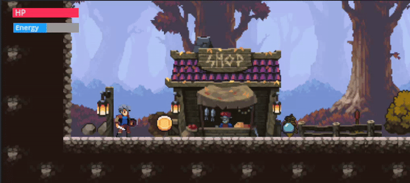

<p align="center">
   </p> <h1 align="center"> Fallen Edge</h1> <p align="center"> Developed by <b>lleodev</b> &  🗡️</p>

<h3>
    Hello there... 
</h3>
<p>
    recenty I fall deeper on game development and made my first project. created with godot and gdScript language. It was a great expirience, couse it was my first game with an engine.
</p>

<h1>Setup</h1>

```bash
# cloning repo
    git clone https://github.com/LeonardoDevelopper/fallen-edge-game
# Turn in directory
    cd fallen-edge
# Now you can run godot and open this project
```

🌟 <h1>Demo</h1>


🌟 <h1>Acquired concepts</h1>

<ul>
    <li><h3>Engine management and Basic nodes such as (Godot)</h3></li>
    <ul>
        <li><h4>characterbody</h4></li>
        <li><h4>collisionshape</h4></li>
        <li><h4>area2D</h4></li>
        <li><h4>raycast</h4></li>
        <li><h4>tilemap</h4></li>
        <li><h4>progressbar</h4></li>
        <li><h4>Animations</h4></li>
        <li><h4>Inputs</h4></li>
        <li><h4>Layers and Masks</h4></li>
        <li><h4>Signals</h4></li>
        <li><h4>Scenario Building</h4></li>
        <li><h4>Node Properties</h4></li>
        <li><h4>Basic colision system</h4></li>
    </ul>
</ul>
<h1>
    with this it was possible
</h1>

<ul>
    <li>
        <strong>
            Create a custom scenario with layers (background, foreground, ground, collectibles, enemies) using my tiles and also defining collisions.
        </strong>
    </li>
    <li>
        <strong>
            Insert collisions into objects and the scenario.
        </strong>
    </li>
    <li>
        <strong>
            Separate the collision system into layers so that certain objects collide only with certain objects.
        </strong>
    </li>
    <li>
        <strong>
            I developed an attack and damage mechanic system using Area2D for the hit and hurt box.
        </strong>
    </li>
    <li>
        <strong>
            I used signals to trigger certain events and execute code snippets. This allows enemies to attack and take damage, performing different animations for each action, and also having a death animation.
        </strong>
    </li>
    <li>
        <strong>
            Each enemy has a progress bar that shows their current hitpoints. The player can also collect coins and energy boosts.
        </strong>
    </li>
</ul>

<h3>
    Só them it was so greatfull working with game development.
</h3>

<h4>By lleodev</h4>